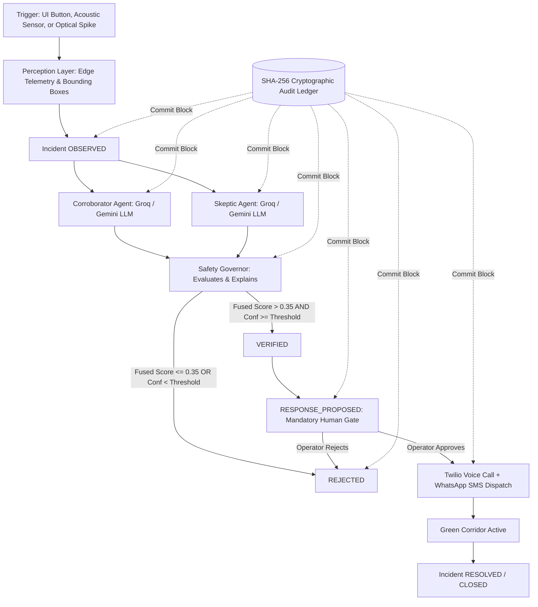

# AuraShield System Architecture

AuraShield is a real-time safety incident verification and emergency orchestration engine designed to drastically shrink the gap between collision impact and emergency dispatch without false-positive alarms.

---

## High-Level Architecture Flow

---

## Core Subsystems

### 1. Adversarial Dual-Agent Verification Engine
- **Corroborator Agent:** Prompted with strict physical telemetry (spatial bounding box overlap ratio, deceleration velocity, pedestrian risk). Identifies corroborating evidence of a vehicular collision.
- **Skeptic Agent:** Prompted to find alternative, benign explanations (e.g., optical shadow artifacts, emergency braking near-miss, windblown debris).
- **Cascade Provider Chain:** 
  $$\text{Groq} \xrightarrow{\text{6s timeout}} \text{Google Gemini (gemini-3.8-flash)} \xrightarrow{\text{6s timeout}} \text{Deterministic Fallback}$$
  Ensures 99.99% availability even under network partitioning or API rate limits.
- **Mathematical Adjudication:**
  $$\text{Fused Score} = S_{\text{corroborator}} - S_{\text{skeptic}} \in [-1.0, +1.0]$$
  Passed only when:
  $$\text{Fused Score} > 0.35 \quad \land \quad \text{Confidence} \ge \tau_{\text{governor}}$$

### 2. State Machine Pipeline
The incident orchestrator enforces a strictly deterministic state transition sequence:
1. `OBSERVED`: Ingestion of raw camera telemetry and initial bounding boxes.
2. `CORROBORATING`: Parallel invocation of Corroborator and Skeptic agents.
3. `VERIFYING`: Governor evaluates adversarial claims and checks confidence thresholds.
4. `VERIFIED` / `REJECTED`: Decision branch based on mathematical thresholds.
5. `RESPONSE_PROPOSED`: **Mandatory Human-in-the-Loop Barrier**. Halts autonomous execution.
6. `DISPATCH_APPROVED`: Authorized human operator triggers physical emergency dispatch.
7. `DISPATCHED`: Real-time WhatsApp/SMS notifications transmitted via Twilio.
8. `RESOLVED`: Clearance of green corridor and emergency team handoff.

### 3. Cryptographic SHA-256 Audit Ledger
- **Immutability:** Every state transition and agent score is serialized into an append-only ledger block.
- **Hash-Chaining:** Block $i$ hash is computed as $\text{SHA-256}(H_{i-1} \mathbin{\Vert} \text{Actor} \mathbin{\Vert} \text{Action} \mathbin{\Vert} \text{Timestamp})$.
- **Zero-Knowledge Verification:** Client and auditor can verify mathematical integrity at any time via `GET /audit/verify`.

### 4. Operator Control Room (Web Interface)
- **Video & Telemetry Panel:** Real-time visual display with bounding boxes and automatic fallback to still poster with amber badge on signal degradation.
- **Agent Tug-of-War Bar:** Dual-agent visual scale normalized to $[-1, +1]$ with dynamic target markers at $67.5\%$ ($+0.35$).
- **Streaming Reasoning Terminal:** Monospace real-time terminal streaming agent debate tokens via WebSocket (`agent_reasoning_chunk`).
- **Operator Control Bar:**
  - `PAUSE AUTOMATION`: Immediate system-wide freeze.
  - `OVERRIDE: REJECT`: Live operator veto for active incidents.
  - `GOVERNOR SENSITIVITY`: Dynamic slider adjusting the required threshold between $0.50$ and $0.95$.
- **Live UTC Clock & Active Pulse LED:** Validates active real-time status.
