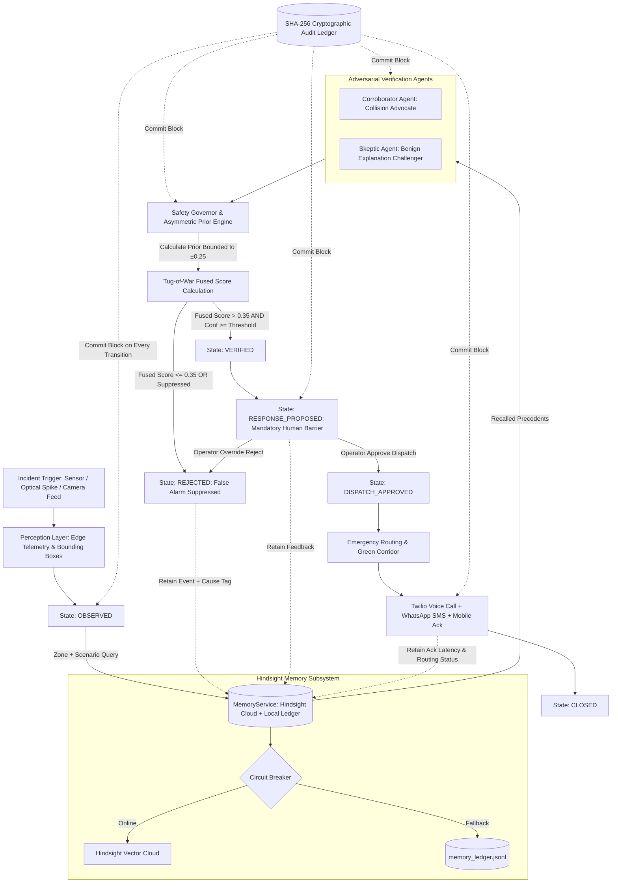

# AuraShield System Architecture
### Multi-Agent Adjudication with Hindsight Persistent Operational Memory

AuraShield is a real-time safety incident verification and emergency orchestration engine designed to drastically shrink the gap between collision impact and emergency dispatch without false-positive alarms.

---

## 1. High-Level Architecture Flow

---

## 2. The Hindsight Persistent Memory Subsystem

The memory subsystem is encapsulated in `backend/memory/` and provides persistent episodic recall across operational sessions.

### 2.1 Dual-Write Architecture & Deterministic Local Ledger
Every memory write follows a dual-write pattern:
1. **Append-Only Local Ledger (`backend/data/memory_ledger.jsonl`):**
   - Immediate synchronous write.
   - Preserves offline reproducibility and instantaneous fallback.
   - Structured JSON records conforming to `MemoryEvent` schema.
2. **Hindsight Cloud (`/v1/banks/{bank_id}`):**
   - Asynchronous vector indexing via Vectorize/Hindsight REST API.
   - Semantic similarity embeddings over incident descriptions and operator notes.

### 2.2 Circuit Breaker State Machine
Network partitions or cloud API rate limits must never stall emergency dispatch:
- **CLOSED (Normal):** Requests routed to Hindsight Cloud. Latency $< 250\text{ ms}$.
- **OPEN (Tripped):** After 3 consecutive timeouts ($>3.0\text{ s}$) or HTTP $5xx$ errors, the circuit breaker opens. All subsequent recall queries fall back instantly to local ledger keyword/tag matching (`source="local-fallback"`).
- **HALF-OPEN (Probing):** Every 30 seconds, a single test recall probe is routed to the cloud. If successful, state returns to CLOSED; if failed, remains OPEN.

### 2.3 Deterministic Prior Formulation & Asymmetric Safety
The prior engine (`backend/memory/prior.py`) translates historical precedents into a calibrated adjustment $\Delta_{\text{fused}}$:

Let $N_{\text{false}}$ be the count of confirmed false alarm precedents (`INCIDENT_REJECTED`, `OPERATOR_OVERRIDE`) in the current zone, and $N_{\text{real}}$ be confirmed collisions (`INCIDENT_VERIFIED`, `OPERATOR_APPROVED`).

1. **High-Confidence Collision Protection (Asymmetric Rule):**
   $$\text{If } S_{\text{corroborator}}^{\text{raw}} \ge 0.85 \implies \Delta_{\text{fused}} = 0.0$$
   *Real collisions are NEVER suppressed by memory, regardless of false alarm history.*

2. **False Alarm Suppression:**
   $$\text{If } S_{\text{corroborator}}^{\text{raw}} < 0.85 \;\land\; N_{\text{false}} \ge 3 \;\land\; N_{\text{false}} > 2 \cdot N_{\text{real}} \implies \Delta_{\text{fused}} = -0.25$$
   The skeptic score is boosted by $+0.25$, driving the fused score below the $+0.35$ threshold and triggering automatic suppression.

3. **Capped Bound:**
   $$\Delta_{\text{fused}} \in [-0.25, +0.15]$$

---

## 3. Adversarial Dual-Agent Verification Engine

- **Corroborator Agent:** Prompted with strict physical telemetry (spatial bounding box overlap ratio, deceleration velocity, pedestrian risk). Identifies corroborating evidence of a vehicular collision.
- **Skeptic Agent:** Prompted to find alternative, benign explanations (e.g., optical shadow artifacts, emergency braking near-miss, windblown debris).
- **Cascade Provider Chain:** 
  $$\text{Groq (Llama-3.3-70b)} \xrightarrow{\text{6s timeout}} \text{Google Gemini} \xrightarrow{\text{6s timeout}} \text{Deterministic Scripted Fallback}$$
  Ensures 99.99% availability even under network partitioning or API rate limits.
- **Mathematical Adjudication:**
  $$S_{\text{fused}}^{\text{pre}} = S_{\text{corroborator}} - S_{\text{skeptic}} \in [-1.0, +1.0]$$
  $$S_{\text{fused}}^{\text{post}} = \text{clamp}(S_{\text{fused}}^{\text{pre}} + \Delta_{\text{fused}}, -1.0, +1.0)$$
  Gated strictly on:
  $$S_{\text{fused}}^{\text{post}} > 0.35 \quad \land \quad \text{Confidence} \ge \tau_{\text{governor}}$$

---

## 4. State Machine Transition Pipeline

The incident orchestrator enforces a strictly deterministic state transition sequence:
1. `OBSERVED`: Ingestion of raw camera telemetry and initial bounding boxes.
2. `CORROBORATING`: Parallel invocation of Corroborator and Skeptic agents with recalled memory precedents.
3. `VERIFYING`: Governor evaluates adversarial claims, computes memory prior, and checks confidence thresholds.
4. `VERIFIED` / `REJECTED`: Decision branch based on mathematical thresholds. If suppressed by memory, transitions to `REJECTED` with `Suppressed by memory (N precedents)`.
5. `RESPONSE_PROPOSED`: **Mandatory Human-in-the-Loop Barrier**. Halts autonomous execution.
6. `DISPATCH_APPROVED`: Authorized human operator triggers physical emergency dispatch.
7. `DISPATCHED`: Real-time WhatsApp/SMS notifications transmitted via Twilio.
8. `ACKNOWLEDGED`: Mobile responder slides acknowledgment on mobile device.
9. `CLOSED`: Clearance of green corridor and emergency team handoff.

---

## 5. Cryptographic SHA-256 Audit Ledger

- **Immutability:** Every state transition, agent score, memory recall, and operator override is serialized into an append-only ledger block.
- **Hash-Chaining:** Block $i$ hash is computed as:
  $$H_i = \text{SHA-256}(H_{i-1} \mathbin{\Vert} \text{Actor} \mathbin{\Vert} \text{Action} \mathbin{\Vert} \text{Timestamp})$$
  Genesis block starts at $H_0 = \text{"0"}^{64}$.
- **Zero-Knowledge Verification:** Client and auditor can verify mathematical integrity at any time via `GET /audit/verify`.

---

## 6. Operator Control Room (Web Interface)

- **Video & Telemetry Panel:** Real-time visual display with bounding boxes and automatic fallback to still poster with amber badge on signal degradation.
- **Agent Tug-of-War Bar:** Dual-agent visual scale normalized to $[-1, +1]$ with ghost marker showing pre-memory score vs. post-memory score and delta readout.
- **Hindsight Memory Panel (`MemoryPanel.tsx`):**
  - Status LED: Green (Hindsight Cloud), Amber (Local Fallback), Grey (Disabled).
  - Memory toggle switch.
  - Recalled precedents list with relevance scores and timestamps.
  - Impact strip showing score shifts and suppression badges.
  - Dynamic Recharts LineChart displaying the learning curve across runs.
  - Operational Insights card synthesizing repeat patterns across city zones.
- **Operator Control Bar:**
  - `PAUSE AUTOMATION`: Immediate system-wide freeze.
  - `OVERRIDE: REJECT`: Live operator veto with cause tag picker (`glare`, `shadow`, `vibration`, `other`).
  - `GOVERNOR SENSITIVITY`: Dynamic slider adjusting the required threshold between $0.50$ and $0.95$.
