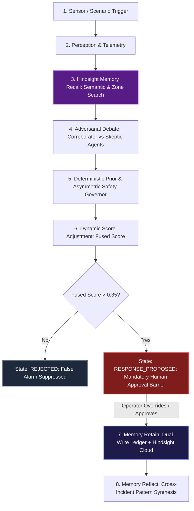

# AuraShield — Municipal Safety Incident Orchestrator
### Powered by Hindsight (Vectorize) Persistent Operational Memory

A real-time safety incident verification and emergency orchestration engine. AuraShield bridges the gap between collision impact and emergency medical dispatch using multi-agent adversarial adjudication, cryptographic SHA-256 audit ledgers, and a mandatory human-in-the-loop safety barrier.

With **Hindsight Memory Integration**, AuraShield operational agents learn continuously from past physical sensor anomalies, operator overrides, and hospital response telemetry—eliminating recurrent false alarms while guaranteeing that real collisions are **never** suppressed.

---

## Quickstart (Run in 2 Commands)

### 1. Start the FastAPI Backend
```bash
cd backend
python -m venv .venv
# On Windows: .venv\Scripts\activate | On macOS/Linux: source .venv/bin/activate
pip install -r requirements.txt
python -m uvicorn main:app --host 0.0.0.0 --port 8000 --reload
```
Backend API will be live at `http://localhost:8000` with Swagger docs at `http://localhost:8000/docs`.

### 2. Start the Frontend Control Room
```bash
# In another terminal window:
npm install
npm run dev
```
Open your browser to `http://localhost:5173` (or `http://localhost:8080`).

---

## How Hindsight Memory is Used

AuraShield employs Hindsight persistent vector memory (`aurashield-ops` bank) across three core operational loops:



### 1. Retain (`backend/memory/service.py` & `main.py`)
- **Operator Overrides (`OPERATOR_OVERRIDE`):** When an operator rejects a candidate incident with a root cause tag (`glare`, `shadow`, `vibration`, `mast_shake`), the system retains the spatial coordinates, time of day, camera ID, and human notes into Hindsight vector memory and the local deterministic ledger (`memory_ledger.jsonl`).
- **Verified Dispatches (`OPERATOR_APPROVED` / `INCIDENT_VERIFIED`):** Confirmed real collisions with ambulance dispatches and hospital destinations are retained as positive ground-truth precedents.
- **Field Telemetry & Routing Feedback (`DISPATCH_ACKED`, `DISPATCH_DECLINED`):** Responder mobile slide acknowledgments, latency, and peak-hour hospital bed saturation declines are retained to optimize future emergency routing.

### 2. Recall (`backend/memory/service.py` & `backend/agents/verification.py`)
- Before running adversarial LLM inference, the system queries Hindsight for the top-5 most relevant historical precedents matching the current zone and environmental conditions.
- Precedents are injected as structured context into both the **Corroborator Agent** (advocate) and **Skeptic Agent** (challenger).
- The **Safety Governor** calculates a deterministic prior bounded strictly to $[-0.25, +0.25]$.

### 3. Reflect (`GET /memory/insights`)
- Synthesizes recurring spatial-temporal patterns across zones (e.g., identifying that Zone 02 has recurring low-sun optical glare between 15:30 and 17:30, or that Hospital Alpha experiences peak trauma bed saturation during Friday evening rush hour).

---

## Dual-Write & Resilient Local Fallback

AuraShield is built for mission-critical municipal infrastructure:
- **Dual-Write Architecture:** Every retained memory event writes synchronously to the append-only `backend/data/memory_ledger.jsonl` and asynchronously to Hindsight Vector Cloud (`/v1/banks/{bank_id}`).
- **Circuit Breaker:** If Hindsight Cloud returns 3 consecutive network timeouts or HTTP errors, the circuit breaker trips open to `source="local-fallback"`.
- **Zero-Downtime Guarantee:** The entire system continues operating with 100% determinism using the local ledger even when completely offline or during WAN network partitioning.

---

## The "Before vs After" Learning Progression

The table below reflects real numbers measured during the automated 15-row E2E scenario matrix run:

| Scenario / Run | Memory Mode | Pre-Memory Fused | Post-Memory Fused | Precedents Recalled | System State | Operator Action Required |
|:---|:---:|:---:|:---:|:---:|:---:|:---:|
| **glare_ambiguous (Run 1: "The Before")** | **OFF** | **+0.50** | **+0.50** | 0 | `RESPONSE_PROPOSED` | **Operator must manually override** |
| **glare_ambiguous (Run 2: 1-2 Overrides)** | **ON** | **+0.50** | **+0.02** | 2 overrides | `CANDIDATE` | Operator confirms glare override |
| **glare_ambiguous (Run 3: "The After")** | **ON** | **+0.50** | **-0.46** | 11 overrides | `REJECTED` | **Zero (Suppressed autonomously)** |
| **crash_zone04 (Real Collision)** | **ON** | **+1.00** | **+1.00** | 7 collisions | `RESPONSE_PROPOSED` | **Mandatory Human Clearance** |

### Key Safety Observation
Even after 11 consecutive false alarm overrides in Zone 02, when a real collision occurs (`crash_zone04`, raw corroborator score $1.0$), **the Asymmetric Safety Rule prevents suppression entirely ($adjustment = 0.0$)**. Real emergencies are never silenced by past false alarms.

---

## Environment Variables

Configure these variables in `backend/.env`:

| Variable | Required | Default | Description |
|:---|:---:|:---|:---|
| `HINDSIGHT_API_KEY` | Optional | `""` | Hindsight Cloud API Key. If empty, runs in resilient local fallback mode. |
| `HINDSIGHT_API_URL` | Optional | `https://api.hindsight.vectorize.io` | Hindsight Cloud API endpoint. |
| `HINDSIGHT_BANK_ID` | Optional | `aurashield-ops` | Vector memory bank identifier. |
| `MEMORY_ENABLED` | Optional | `1` | Global memory toggle (`1` = ON, `0` = OFF). |
| `GROQ_API_KEY` | Optional | `""` | Primary high-speed LLM inference key (Llama-3.3-70b). |
| `GEMINI_API_KEY` | Optional | `""` | Secondary LLM fallback key. |
| `HF_TOKEN` | Optional | `""` | Hugging Face inference key. |
| `TWILIO_ACCOUNT_SID` | Optional | `""` | Twilio SMS/WhatsApp dispatch SID. |
| `TWILIO_AUTH_TOKEN` | Optional | `""` | Twilio SMS/WhatsApp dispatch Auth Token. |
| `TWILIO_DISPATCH_TO` | Optional | `""` | Emergency responder recipient phone number. |
| `PORT` | Optional | `8000` | FastAPI server port. |

---

## Automated Verification & Test Commands

Run the full end-to-end verification suites:

```bash
cd backend

# 1. Run the 15-Row Scenario Matrix (Validates Before/After, Asymmetric Safety, and Fallback)
.\.venv\Scripts\python.exe e2e_memory.py

# 2. Run the Full Memory Unit Test Suite (22 Unit Tests)
.\.venv\Scripts\python.exe -m pytest test_memory_service.py test_memory_prior.py test_learning_loop.py test_memory_api.py test_verification_memory.py -v

# 3. Seed Realistic Operational History
.\.venv\Scripts\python.exe seed_memory.py --reset
```

Frontend build and lint verification:
```bash
# In project root:
npm run lint
npm run build
```

---

## Provenance & Disclosure

- **Base Project:** The base AuraShield municipal incident adjudication architecture (FastAPI state machine, initial UI layout, and dual-agent scoring) was created prior to the hackathon.
- **Hindsight Memory Subsystem:** All Hindsight persistent vector memory integrations, dual-write ledger (`backend/memory/ledger.py`), circuit breaker (`backend/memory/service.py`), deterministic asymmetric safety governor (`backend/memory/prior.py`), `glare_ambiguous` scenario, `MemoryPanel.tsx` UI with dynamic Recharts learning curve, and the 15-row scenario matrix test (`backend/e2e_memory.py`) were developed as **new work** specifically for this integration.
- **Synthetic Data:** All historical seeds, zone sensor coordinates, and camera video clips are synthetic demonstration assets for municipal emergency scenarios.
